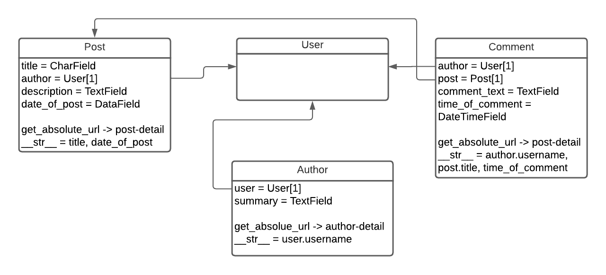

# Django DIYBLOG

### В этом репозитории представлен проект блога на Django, поддеживающий следующие функции:
1. Стандартную аутентификацию пользователя;
2. Обновление пароля в случае его потери путем email рассылки;
3. Создание поста;
4. Создание комментария.

Авторизованные пользователи имеют доступ на создание публикаций и комментариев, остальные имеют доступ к их просмотру. 

## Модели проекта 


Комментарии и публикации отсортированы по дате написания (от более свежих к более старым).

## URLs
```
blog/ - домашняя страница с описанием
blog/blogs/ - список всех сообщений в блоге
blog/blogger/<author-id>/ - информация об авторе и список постов
blog/<blog-id>/ - сведения о блоге
blog/bloggers/ - список блогеров
blog/<blog-id>/create/ - создать комментарий для публикации
accounts/<standart-urls>/ - стандартная аутентификация django
blog/create/ - создать публикацию
```